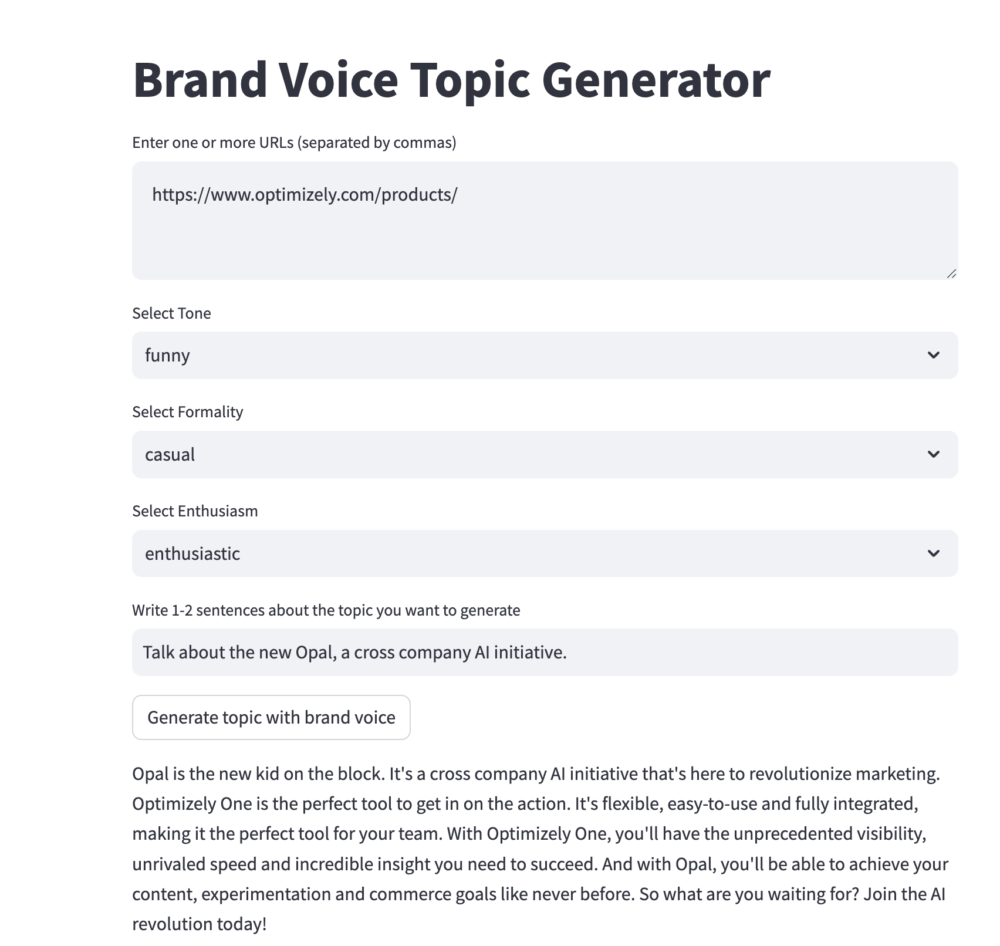

# Brand Voice Topic Generator

This is a Streamlit app that allows users to input URLs to scrape text from, and then generate text about a given user topic with a specific tone, formality, and enthusiasm, having as a base (i.e., the brand voice) the scraped texts from the provided URLs.

The generation of text is done using an Azure OpenAI LLM (Large-Language Model).

# Installation
 
You can install the required libraries using:
```
pip install requirements.txt
```
 
# Configuration

To use the app, you will need to configure the following secrets in your Streamlit app's configuration:
```
[azureopenai]
AZURE_OPENAI_ENDPOINT = "https://<your_endpoint>.openai.azure.com/"
AZURE_OPENAI_KEY = "<your_key>"
AZURE_OPENAI_DEPLOYMENT_NAME = "<your_deployment_name>"
```
You can set these secrets in a secrets.toml file in a folder called .streamlit (i.e., `.streamlit/secrets.toml`) or in the "Secrets" tab of your Streamlit app's configuration.


# Usage

To run the app, run the following command:
```
streamlit run topic-brand-voice.py
```

This will start a Streamlit server and launch the app in your browser.

When the app starts, you can input one or more URLs (separated by commas) to scrape text from, and select a tone, formality, and enthusiasm level using the dropdown menus. You need to enter the topic you want to generate text about, using at least 1-2 sentences in the text input box.

Once you have input the required information, click the "Generate topic with brand voice" button to generate text about the given user topic with the specified tone, formality, and enthusiasm level using an Azure OpenAI LLM. 

The app will scrape the text from the provided URLs, combine it, and send it to the LLM to generate the topic in the brand voice. The app will then display the generated topic in the brand voice.

The following figure depicts an example:

